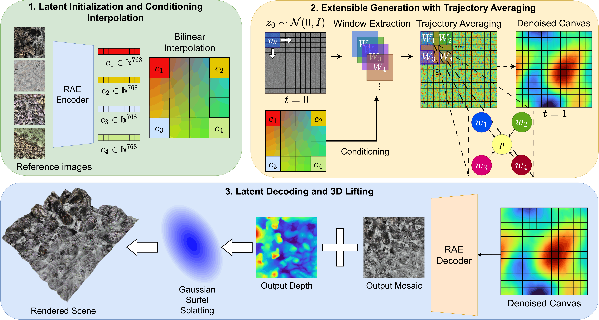
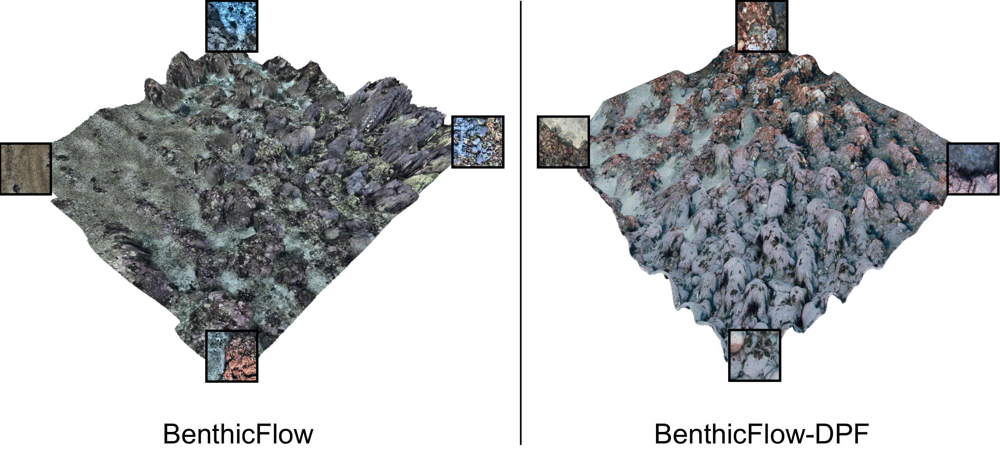
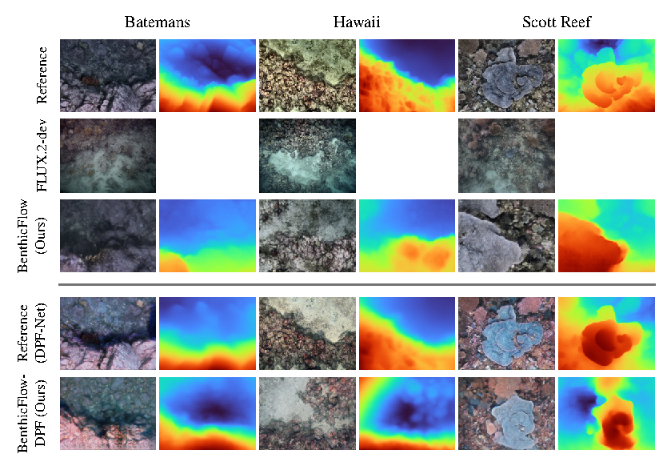
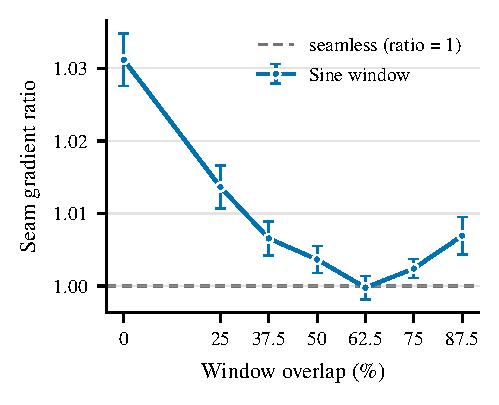
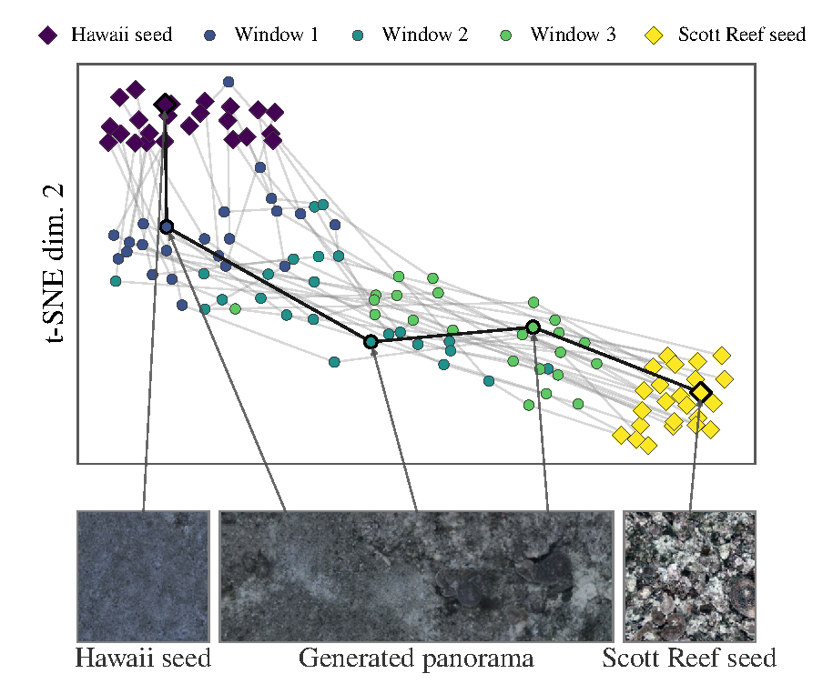

# BenthicFlow

**Generating Extensible Underwater Environments via Flow Matching** · *ECCV 2026, Marine Vision Workshop*
<!-- Fig. 1: export paper/figures/multidiffusion.pdf -> assets/multidiffusion-1.png -->
<p align="center">
  
  <br/>
  <em>Fig. 1 — Overview of the generative pipeline.</em>
</p>
<!-- Fig. 4: export paper/figures/teaser.pdf -> assets/teaser-1.png -->
<p align="center">
  
  <br/>
  <em>Fig. 4 — Scenes generated at 32× the training resolution from four reference seeds (framed), rendered as surfel splats.</em>
</p>

BenthicFlow is a unified generative pipeline for benthic (seafloor) environments.
A **single conditional flow matching model** jointly synthesizes aligned RGB and
depth, and a MultiDiffusion-inspired windowed sampler extends generation to
scenes of unbounded spatial extent — no separate inpainting or stitching network.
Generated RGB-D mosaics are lifted into continuous 3D scenes with
**surface-aligned Gaussian surfels**.

**Contributions** (paper, Sec. 1):

- A windowed flow-matching formulation that unifies generation and in-painting
  into a single pass, producing extensible RGB-D domains from one model.
- A single conditional velocity field spanning multiple geographically distinct
  survey sites, interpolating smoothly between them.
- A lifting stage projecting generated RGB-D mosaics into point clouds and
  surface-aligned Gaussian splats for spatially continuous 3D reconstruction.

## Method

| Stage (paper) | What happens | Code |
|---|---|---|
| **d-RAE** (Sec. 3) | Frozen DINOv2-B/14 encodes RGB; a depth ViT trained from scratch encodes depth; per-token LayerNorm fuses both into a 1024-d latent; a convolutional decoder reconstructs RGB-D | `models/rae.py`, trained by `scripts/train_rae_ddp.py` |
| **Conditioning** (Sec. 3.1) | Reference seeds are mean-pooled into global appearance descriptors and bilinearly interpolated into a conditioning grid | `scripts/lift_panorama_hero.py` |
| **Conditional flow matching** (Sec. 3.2) | Rectified flow with classifier-free guidance (`p_uncond` 0.1, scale 3); U-Net velocity field over 16×16×1024 latent windows | `models/unet_cfm.py`, trained by `scripts/train_cfm_cfg.py` |
| **Extensible sampling** (Sec. 3.2) | Overlapping windows denoised concurrently; guided velocities averaged per token under a sine window (62.5 % overlap optimum, Fig. 3a) | sampler in `scripts/lift_panorama_hero.py` / `scripts/test_panorama.py` |
| **3D lifting** (Sec. 3.3) | Pixels unprojected to surfels oriented by local depth gradients; anchored appearance-only refinement | `scripts/lift_panorama_3d.py`, `scripts/lift_panorama_single.py` |

Two preprocessing variants are modeled (Sec. 2): **BenthicFlow** — CLAHE
exposure normalization + Depth-Anything-V2 relative depth — and
**BenthicFlow-DPF** — DPF-Net physics-informed correction + approximate metric
depth. The DPF-Net enhancement network is vendored in [dpf_net/](dpf_net/), and
the DPF variant of the pipeline runs from this repo via `REEF_VARIANT=dpf`
(see [§ BenthicFlow-DPF variant](#6--benthicflow-dpf-variant-launch_scriptsdpf)).

## Dataset

600k+ benthic nadir frames from the [Squidle+](https://squidle.org)
collaborative framework, captured by the IMOS AUV *Sirius* over two Australian
reefs and the northwestern coast of Hawai'i:

| Location | Campaigns |
|---|---|
| Scott Reef | ScottReef200907 · ScottReef201108 · ScottReef201503 |
| Batemans Bay | Batemans201011 · Batemans201211 · Batemans201411 |
| Hawai'i | Hawaii201801 |

Frames are exposure-normalized and standardized to 224×224, with a
Depth-Anything-V2 depth map retained as a fourth channel. Splits are made **at
the deployment level** (one validation + one test deployment per campaign,
~500k / ~90k / ~90k) to prevent temporal leakage — they are regenerated
deterministically (fixed seed) into `data_split/` by `launch_scripts/data/split_data.sh`.

## Repository layout

```
BenthicFlow/
├── benthicflow/     core package: path config, I/O helpers, RGBD loaders, viz
├── models/          d-RAE, U-Net CFM, masked CFM, losses
├── data_utils/      Squidle+ download, campaign discovery scripts
├── scripts/         all Python entry points (run as `python scripts/<name>.py`)
│                    (*_dpf.py = BenthicFlow-DPF forks; they force BENTHICFLOW_VARIANT=dpf)
├── dpf_net/         vendored DPF-Net enhancement network (upstream code + DPEM
│                    + bundled Depth-Anything-V2) and clean_and_extract.py
├── launch_scripts/  all launch scripts, grouped by pipeline stage
│   ├── setup/       one-time builds (gsplat CUDA extension)
│   ├── data/        download → normalize → features/depth/RGB → splits
│   ├── train/       d-RAE and CFM training (single-GPU and DDP)
│   ├── eval/        paper tables: FID/KID, k-NN, stitching, splat ablation
│   ├── generate/    hero panoramas, single-image lifting, 3D scenes
│   ├── figures/     paper figures, PCA / t-SNE latent visualizations
│   └── dpf/         the BenthicFlow-DPF pipeline (enhance → features → train → eval)
├── data_split/      train/val/test CSVs (regenerated by launch_scripts/data/split_data.sh)
├── assets/          demo inputs and README figures
├── env.sh           cluster configuration sourced by every job (edit me)
└── environment.yml  conda/mamba spec for the `ocean2` environment
```

## Setup

Runs on any Unix-like system (Linux/macOS) with Python and GPU compute (single GPU or multi-GPU DDP), or on a SLURM cluster.

**1. Clone and create the environment:**

```bash
git clone <this-repo> BenthicFlow && cd BenthicFlow
conda env create -n ocean2 --file environment.yml     # creates env "ocean2" (or: mamba env create -n ocean2 --file environment.yml)
conda activate ocean2
mkdir -p logs                                         # execution logs land here
```

**2. Configure `env.sh`** — sourced by all job scripts and environment setups. By default, all data, feature caches, depth caches, and checkpoints are stored in local folders inside the repository root (`PROJECT_ROOT`):

| Variable | Meaning | Default |
|---|---|---|
| `CURRENT_ENV` | conda env name | `ocean2` |
| `PROJECT_ROOT` | repository root | `$PWD` |
| `BENTHICFLOW_SCRATCH_ROOT` | data, feature/depth caches, and checkpoints | `$PROJECT_ROOT` |
| `BENTHICFLOW_DATA_SCRATCH_ROOT` | raw Squidle+ downloads | `$PROJECT_ROOT/data` |
| `BENTHICFLOW_SCRATCH_NODE_ROOT` | local scratch for DDP jobs | `$BENTHICFLOW_SCRATCH_ROOT` |
| `HF_HOME`, `TORCH_HOME` | HuggingFace and PyTorch model caches | `$PROJECT_ROOT/.cache/` |

**3. Download Pretrained Weights** (d-RAE and CFM):
Pretrained weights for both the standard (CLAHE) model and the DPF-Net enhanced variant are published on Hugging Face at [`jacomof/Benthic-Flow`](https://huggingface.co/jacomof/Benthic-Flow).

Download the weights into the local `checkpoints/` and `checkpoints-dpf/` directories inside the repository:

```bash
# Activate environment
conda activate ocean2

# Download Standard (CLAHE) weights -> checkpoints/
python -c "from huggingface_hub import hf_hub_download; \
hf_hub_download('jacomof/Benthic-Flow', filename='standard/rae/last.pt', local_dir='checkpoints'); \
hf_hub_download('jacomof/Benthic-Flow', filename='standard/cfm/best_model.pt', local_dir='checkpoints')"
mv checkpoints/standard/* checkpoints/ && rm -rf checkpoints/standard

# Download DPF-Net variant weights -> checkpoints-dpf/
python -c "from huggingface_hub import hf_hub_download; \
hf_hub_download('jacomof/Benthic-Flow', filename='dpf/rae/last.pt', local_dir='checkpoints-dpf'); \
hf_hub_download('jacomof/Benthic-Flow', filename='dpf/cfm/best_model.pt', local_dir='checkpoints-dpf')"
mv checkpoints-dpf/dpf/* checkpoints-dpf/ && rm -rf checkpoints-dpf/dpf
```

The resulting checkpoint directory structure will be:
```text
BenthicFlow/
├── checkpoints/
│   ├── rae/
│   │   └── last.pt
│   └── cfm/
│       └── best_model.pt
└── checkpoints-dpf/
    ├── rae/
    │   └── last.pt
    └── cfm/
        └── best_model.pt
```

**4. Secrets** go in an untracked `env.local.sh` (sourced automatically by
`env.sh`, gitignored — never commit tokens):

```bash
echo 'export HF_TOKEN=hf_...'   >> env.local.sh   # gated models (FLUX.2 baseline)
echo 'export SQUIDLE_TOKEN=...' >> env.local.sh   # optional, faster downloads
```

**5. (Only for 3D surfel splatting / lifting)** Install `gsplat` separately against your environment's PyTorch:

```bash
# Option A: Local Unix environment
bash scripts/install_gsplat_local.sh

# Option B: SLURM cluster environment
sbatch launch_scripts/setup/install_gsplat.sh
```

### Running scripts & jobs

**Always run from the repository root** so `env.sh` resolves and `PROJECT_ROOT` defaults correctly. Scripts can be executed directly via bash or submitted to a SLURM cluster:

```bash
# Option A: Run directly via bash / python locally
source env.sh
bash launch_scripts/eval/test_generation.sh

# Option B: Submit to a SLURM cluster
sbatch launch_scripts/eval/test_generation.sh
```

Scripts fail fast with a clear error if executed outside the repo root. Logs land in `logs/`.

## Running the pipeline

### 1 · Data (`launch_scripts/data/`)

Run in order; each step reads the previous step's output from scratch.

| Job | What it does |
|---|---|
| `pull_data_stratified.sh` | Download the Sirius AUV imagery from Squidle+ (campaigns discovered by keyword — edit `KEYWORDS` in `data_utils/pull_dreamsea_data_stratified.py` to select the Scott Reef / Batemans / Hawaii campaigns) |
| `normalize.sh` | GPU CLAHE exposure normalization → `data_normalized/` |
| `extract_features_array.sh` | DINOv2 patch-token grids at 518×518 → `features/` (.npy) |
| `extract_depth_array.sh` / `get_depth.sh` | Depth-Anything-V2 maps → `depth/` (`get_depth` runs one campaign per array task) |
| `precompute_rgb.sh` | Per-deployment uint8 RGB arrays for fast mmap reads → `rgb/` |
| `split_data.sh` | Generate `data_split/{train,val,test}.csv` (deployment-level, fixed seed) |

### 2 · Training (`launch_scripts/train/`)

| Job | Paper | What it does |
|---|---|---|
| `train_rae_ddp.sh` | Sec. 4.1 | d-RAE with the three-phase curriculum (L1 → +LPIPS → +GAN with adaptive weighting), 4-GPU DDP |
| `train_cfm_ddp_cfg.sh` | Sec. 3.2 | **Final model**: U-Net CFM with CFG (`p_uncond` 0.1), 4-GPU DDP |
| `train_cfm_ddp_cfg_high_p_uncond.sh` | — | Ablation with `p_uncond` 0.2 |

DDP jobs automatically detect if a separate node-local scratch (`BENTHICFLOW_SCRATCH_NODE_ROOT`) is configured (e.g., when requesting `--constraint=scratch-node` on SLURM clusters) and stage features/depth/rgb to fast local storage before launching `torchrun`. On standard local systems, files are read directly from local repo folders.

### 3 · Evaluation (`launch_scripts/eval/`) — paper tables & diagnostics

| Job | Paper | What it does |
|---|---|---|
| `test_generation.sh` | Tab. 1 | FID / KID (Inception-v3) and DINOv2 cosine similarity of generated frames (conditional + unconditional) |
| `flux_test_generation.sh` | Tab. 1 | FLUX.2-dev (4-bit) baseline, multi-GPU torchrun |
| `knn_campaign_classifier.sh` / `flux_knn_campaign_classifier.sh` | Tab. 2 | k-NN (k=20) location classifier on pooled DINOv2 embeddings, real vs generated |
| `test_reconstruction.sh` | Tab. 3 | d-RAE depth consistency on held-out test data (RMSE, Pearson r) |
| `eval_stitching.sh` / `eval_stitching_no_hann.sh` | Fig. 3a | Seam Gradient Ratio across window overlaps (0–87.5 %); windowing ablation |
| `ablate_splat.sh` | Tab. 4 | Lifting ablation: surfels vs isotropic Gaussians, anchored refinement, perceptual polish (PSNR / SSIM / LPIPS) |
| `qualitative_comparison.sh` | Fig. 2 | 5-row figure: Original / FLUX.2 / BenthicFlow / DPF reference / BenthicFlow-DPF (all rows are stages of `scripts/qualitative_comparison.py`) |

<!-- Fig. 2: export paper/figures/qualitative_comparison.pdf -> assets/fig2_qualitative.png -->
<p align="center">
  
  <br/>
  <em>Fig. 2 — Qualitative comparison vs FLUX.2-dev (image + predicted depth per column pair).</em>
</p>

### 4 · Generation (`launch_scripts/generate/`)

| Job | What it does |
|---|---|
| `generate_hero.sh` (+ `_batemans`, `_hawaii`, `_scott_*`) | Four-corner-conditioned panoramas with provenance (Fig. 4 scenes); saves the RGB-D blob `hero_rgbd.pt` |
| `lift_panorama.sh` | Lift a single RGB image (see `assets/`) into a 2.5D surfel splat |
| `generate_3d.sh` | RGB(-D) frame → point cloud / splat |
| `flux_generation.sh` | FLUX img2img reef variations |
| `find_colorful_refs.sh` | Rank frames by colourfulness to pick panorama seeds |

The hero scripts reference specific frames under
`$PROJECT_ROOT/data_normalized/` — these exist once the data pipeline has run.

### 5 · Figures (`launch_scripts/figures/`)

| Job | Paper | What it does |
|---|---|---|
| `panorama_tsne.sh` | Fig. 3b | t-SNE of DINOv2 window embeddings along a two-seed interpolation |
| `gen_figures.sh` | — | Assembles paper figures from checkpoints → `figures_paper/` |
| `pca.sh` | — | Patch-level latent maps (PCA-RGB) per deployment |

<!-- Fig. 3: export paper/figures/stitching_seam_ratio.pdf and paper/figures/panorama_tsne.pdf -> assets/fig3a_sgr.png / assets/fig3b_tsne.png -->
<p align="center">
  
  &nbsp;
  
  <br/>
  <em>Fig. 3 — (a) Seam Gradient Ratio vs window overlap; (b) semantic interpolation between reference seeds.</em>
</p>

### 6 · BenthicFlow-DPF variant (`launch_scripts/dpf/`)

The paper's second preprocessing configuration replaces CLAHE + relative depth
with **DPF-Net** physics-informed enhancement + approximate **metric** depth
(Sec. 2). It runs entirely from this repo as a parallel pipeline selected by
`REEF_VARIANT=dpf`:

- **Data roots** get a `-dpf` suffix (`features-dpf/`, `depth-dpf/`, `rgb-dpf/`,
  `checkpoints-dpf/`, `data_normalized-dpf/`), so both variants coexist on the
  same scratch. `scripts/*_dpf.py` force the variant themselves; the
  `launch_scripts/dpf/` jobs also export it.
- **Geometry**: DPF imagery uses a 266 px / 19-patch DINOv2 grid (vs 518 px)
  and 256 px DPF depth resized to match.
- **Metric depth**: the d-RAE depth head switches from `sigmoid` to `softplus`
  (unbounded positive depth) and trains with a SILog + multi-scale gradient
  loss instead of L1 — this follows `REEF_VARIANT` automatically
  (`models/rae.py`, `models/losses.py`).

Run in order (after the raw Squidle+ pull from step 1):

| Job | What it does |
|---|---|
| `clean_and_extract.sh` | Run DPF-Net enhancement over raw deployments → processed RGB + metric depth (`data_normalized-dpf/`, `depth-dpf/`). Requires the upstream DPF-Net checkpoints — see [dpf_net/README.md](dpf_net/README.md) |
| `extract_features.sh` | DINOv2 patch grids at 266 px → `features-dpf/` |
| `precompute_rgb.sh` | Per-deployment uint8 RGB arrays → `rgb-dpf/` |
| `train_rae_ddp.sh` | d-RAE with softplus depth head + SILog loss, 4-GPU DDP |
| `train_cfm_ddp_cfg.sh` | U-Net CFM with CFG on the DPF latents (`unet_cfm_final_dpf`) |
| `test_generation.sh` | FID / KID / cosine similarity + depth consistency (Tab. 1 & 3, DPF rows) |
| `knn_campaign_classifier.sh` | k-NN location classifier (Tab. 2, DPF row) |

The vendored [dpf_net/](dpf_net/) directory is the upstream
[DPF-Net](https://github.com/OUCVisionGroup/DPF-Net) codebase
(with its DPEM module and a bundled Depth-Anything-V2) plus
`clean_and_extract.py`, the glue that batch-processes reef campaigns. Upstream
model weights (`DPF-Net.pth`, `DPEM_finetune.pth`, `depth_anything_v2_vits.pth`)
are downloaded per `dpf_net/README.md` and are gitignored.

## Conventions

- Python entry points live in `scripts/` and are invoked from the repo root
  (`python scripts/<name>.py`); they import the top-level packages `REEF`,
  `models`, `data_utils` (put on `PYTHONPATH` by `env.sh`).
- `REEF/__init__.py` resolves all data locations from `REEF_SCRATCH_ROOT` /
  `REEF_SCRATCH_NODE_ROOT` and creates missing directories on import;
  `REEF_VARIANT=dpf` switches every root to its `-dpf` counterpart.
- Runtime outputs at the repo root (`figs/`, `figs-dpf/`, `checkpoints/`,
  `logs/`, `pca/`, `data_normalized/`) are gitignored, as are the DPF-Net
  weights (`checkpoint/`, `depth_anything_v2_vits.pth`).
- `scripts/convert_features_npz_to_npy.py` and
  `scripts/convert_depth_npz_to_npy.py` are one-time converters kept for
  reference (the pipeline now writes `.npy` directly).

## Citation

*Paper coming soon on arxiv and ECCV 2026 proceedings.*

## Acknowledgements

Imagery from public [Squidle+](https://squidle.org) collections of the IMOS AUV
*Sirius*. The BenthicFlow-DPF variant builds on
[DPF-Net](https://github.com/OUCVisionGroup/DPF-Net) (Mei et al., *ISPRS
Journal of Photogrammetry and Remote Sensing*, 2025), whose codebase is
vendored in [dpf_net/](dpf_net/) together with its upstream citation. Also
built on DINOv2, Depth-Anything-V2, gsplat, and the RAE and MultiDiffusion
formulations.

